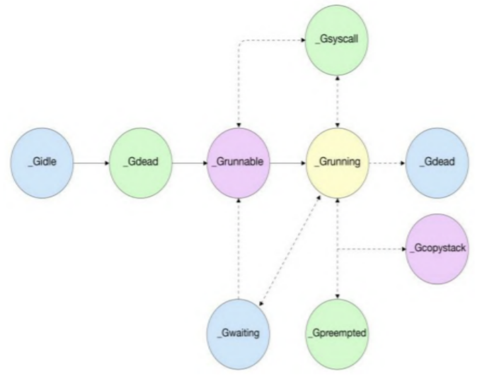
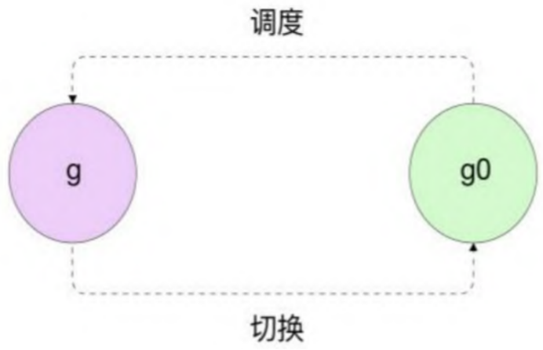
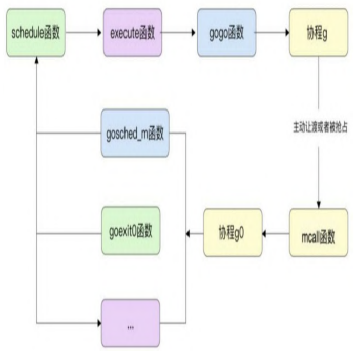
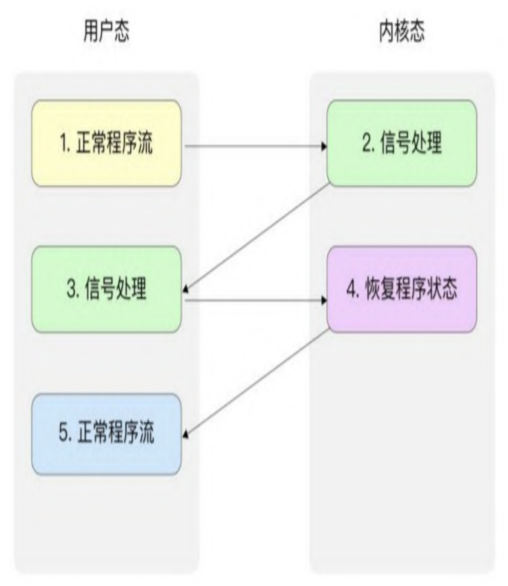

# 进程、线程和协程
* 进程就是应用程序的启动实例，拥有代码和打开的文件资源、数据资源、独立的内存空间。
* 线程从属于进程，是程序的实际执行者。一个进程至少包含一个主线程，也可以有更多的子线程，并拥有自己的栈空间。

对操作系统来说，线程是最小的执行单元，进程是最小的资源管理单元。
* 协程Goroutine是一种比线程更加轻量级的存在。正如一个进程可以拥有多个线程一样，一个线程也可以拥有多个协程。协程的调度完全由用户控制，拥有自己的寄存器上下文和栈。协程调度切换时，将寄存器上下文和栈保存到其他地方，在切回来的时候，恢复先前保存的寄存器上下文和栈，直接操作栈则基本没有内核切换的开销，可以不加锁的访问全局变量，所以上下文的切换非常快。

# GMP模型
Go进程中的众多协程其实依托于线程，借助操作系统将线程调度到CPU执行，从而最终执行协程。在GMP模型中，G代表的是Go语言中的协程(Goroutine），M代表的是实际的线程，而P代表的是Go逻辑处理器(Process)。

在任一时刻，一个P可能在其本地包含多个G，同时，一个P在任一时刻只能绑定一个M，具体对应的是哪一个M也是不固定的，一个M可能在某些时候转移到其他的P中执行。同样的，一个G并不是固定绑定同一个P的，有很多情况(例如P在运行时被销毁)会导致一个P中的G转移到其他的P中。

# 协程设计与调度原理
## 协程的生命周期与状态转移

* _Gidle为协程刚开始创建时的状态，当新创建的协程初始化后，会变为_Gdead状态，_Gdead状态也是协程被销毁时的状态。
* _Grunnable表示当前协程在运行队列中，正在等待运行。
* _Grunning代表当前协程正在被运行，已经被分配给了逻辑处理器和线程。
* _Gwaiting表示当前协程在运行时被锁定，不能执行用户代码。在垃圾回收及channel通信时经常会遇到这种情况。
* _Gsyscall代表当前协程正在执行系统调用。
* _Gpreempted是Go 1.14新加的状态，代表协程G被强制抢占后的状态。
* _Gcopystack代表在进行协程栈扫描时发现需要扩容或缩小协程栈空间，将协程中的栈转移到新栈时的状态。

## 特殊协程g0与协程切换
main函数是一个特殊的协程，当主协程退出时，程序直接退出。main协程在整个程序中只有一个。每个线程中都有一个特殊的协程g0。

协程g0运行在操作系统线程栈上，其作用主要是执行协程调度的一系列运行时代码，而一般的协程无差别地用于执行用户代码。在用户协程退出或者被抢占时，意味着需要重新执行协程调度，这时需要从用户协程g切换到协程g0

## 线程本地存储与线程绑定
线程本地存储使用线程本地的静态或全局内存，线程本地存储中的变量只对当前线程可见。

Go语言运行时的调度器使用线程本地存储将具体操作系统的线程与运行时代表线程的m结构体绑定在一起。
线程本地存储的实际是结构体m中m.tls的地址，同时m.tls[0]会存储当前线程正在运行的协程g的地址，因此在任意一个线程内部，通过线程本地存储，都可以在任意时刻获取绑定到当前线程上的协程g、结构体m、逻辑处理器P、特殊协程g0等信息。
## 调度循环
调度循环指从调度协程g0开始，找到接下来将要运行的协程g、再从协程g切换到协程g0开始新一轮调度的过程。

1. schedule函数处理具体的调度策略，选择下一个要执行的协程；
2. execute函数执行一些具体的状态转移、协程g与结构体m之间的绑定等操作；
3. gogo函数是与操作系统有关的函数，用于完成栈的切换及CPU寄存器的恢复。
4. 执行完毕后，切换到协程g执行。当协程g主动让渡、被抢占或退出后，又会切换到协程g0进入第二轮调度。
5. 在从协程g切换回协程g0时，mcall函数用于保存当前协程的执行现场，并切换到协程g0继续执行，mcall函数仍然是和平台有关的汇编指令。
6. 切换到协程g0后会根据切换原因的不同执行不同的函数，例如，如果是用户调用Gosched函数则主动让渡执行权，执行gosched_m函数
7. 如果协程已经退出，则执行goexit函数，将协程g放入p的freeg队列，方便下次重用。
8. 执行完毕后，再次调用schedule函数开始新一轮的调度循环，从而形成一个完整的闭环，循环往复。

## 调度策略
调度的核心策略位于schedule函数中。
1. Go语言调度器将运行队列分为局部运行队列与全局运行队列。局部运行队列是每个P特有的长度为256的数组，该数组模拟了一个先入先出循环队列。在每个P内部还有一个特殊的runnext字段标识下一个要执行的协程。如果runnext不为空，则会直接执行当前runnext指向的协程。
2. 如果runnext为空则从局部运行队列中寻找（虽然在大部分情况下只有当前P访问局部运行队列，但是可能存在其他P窃取任务造成同时访问的情况，因此，在这里访问时需要加锁。）
3. 当从局部运行队列获取不到时，再从全局队列（链表）中获取。此外，P中每执行61次调度，就需要优先从全局队列中获取一个G到当前P中，并执行下一个要执行的G。
4. 如果局部运行队列满了，那么调度器会将局部运行队列的一半放入全局队列。
5. 如果全局队列也没有找到要执行的G，则会尝试从其他的P中窃取可用的协程，将要窃取的P本地运行队列中G个数的一半放入自己的运行队列中。
6. 正常的程序基本都能获取到要运行的G，如果窃取不到任务，那么当前的P会解除与M的绑定，P会被放入空闲P队列中，而与P绑定的M没有任务可做，进入休眠状态。
## 调度时机
### 主动调度
协程可以选择主动让渡自己的执行权利，这主要是通过用户在代码中执行runtime.Gosched函数实现的。在大多数情况下，用户并不需要执行此函数，因为Go语言编译器会在调用函数之前插入检查代码，判断该协程是否需要被抢占。但是有一些特殊的情况，例如一个密集计算，无限for循环的场景，这种场景由于没有抢占的时机，在Go1.14版本之前是无法被抢占的。Go 1.14之后的版本对于长时间执行的协程使用了操作系统的信号机制进行强制抢占。这种方式需要进入操作系统的内核，速度比不上用户直接调度的runtime.Gosched函数。

主动调度的原理：先从当前协程切换到协程g0，取消G与M之间的绑定关系，将G放入全局运行队列，并调用schedule函数开始新一轮的循环。
### 被动调度
被动调度指协程在休眠、channel通道堵塞、网络I/O堵塞、执行垃圾回收而暂停时，被动让渡自己执行权利的过程。被动调度是协程发起的操作，可以保证最大化利用CPU的资源。
和主动调度类似的是，被动调度需要先从当前协程切换到协程g0，更新协程的状态并解绑与M的关系，重新调度。和主动调度不同的是，被动调度不会将G放入全局运行队列，如果当前协程需要被唤醒，那么会先将协程的状态从_Gwaiting转换为_Grunnable，并添加到当前P的局部运行队列中。
### 抢占调度
Go语言在初始化时会启动一个特殊的线程来执行系统监控任务。系统监控在一个独立的M上运行，不用绑定逻辑处理器P，系统监控每隔10ms会检测是否有准备就绪的网络协程，并放置到全局队列中。系统监控服务会判断当前协程是否运行时间过长，或者处于系统调用阶段，如果是，则会抢占当前G的执行。 
#### 执行时间过长的抢占调度
Go 1.14之后引入了信号强制抢占的机制，借助类UNIX操作系统信号处理机制，Go语言借助用户态在信号处理时完成协程的上下文切换的操作，需要借助进程对特定的信号进行处理。

#### 系统调用阶段
当前正在工作的线程会陷入等待状态，等待内核完成系统调用并返回。当发生下面3种情况之一时，需要抢占调度：
1. 当前局部运行队列中有等待运行的G。抢占调度是为了让局部运行队列中的协程有执行的机会。
2. 当前没有空闲的P和自旋的M。如果有空闲的P和自旋的M，说明当前比较空闲，那么释放当前的P也没有太大意义。
3. 当前系统调用的时间已经超过了10ms，这和执行时间过长一样，需要立即抢占。
系统调用时的抢占原理主要是将P的状态转化为_Pidle，判断是否需要找到一个新的M来接管当前的P。当发生如下条件之一时，需要启动一个M来接管：
* 本地运行队列中有等待运行的G。
* 需要处理一些垃圾回收的后台任务。
* 所有其他P都在运行G，并且没有自旋的M。
* 全局运行队列不为空。
* 需要处理网络socket读写等事件。
当这些条件都不满足时，才会将当前的P放入空闲队列中。

当寻找可用的M时，需要先在M的空闲列表中查找是否有闲置的M，如果没有，则向操作系统申请一个新的M，即线程。

如果工作线程的P被抢占，系统调用的工作线程从内核返回后，首先保存当前G的执行环境，并解除P与M之间的绑定，将P放置到oldp中，然后重新绑定P，过程分为三个步骤：
1. 尝试能否使用之前的oldp，如果当前的P处于_Psyscall状态，则说明可以安全地绑定此P。
2. 当P不可使用时，说明其已经被系统监控线程分配给了其他的M，此时加锁从全局空闲队列中寻找空闲的P。
3. 如果空闲队列中没有空闲的P，则需要将当前的G放入全局运行队列，当前工作线程进入睡眠状态。当休眠被唤醒后，才能继续开始调度循环。

